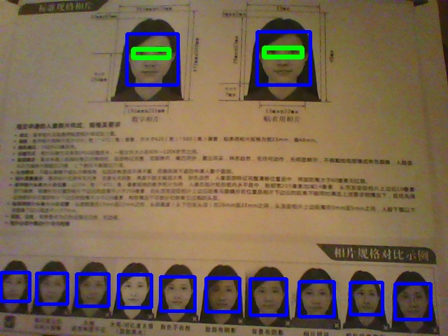
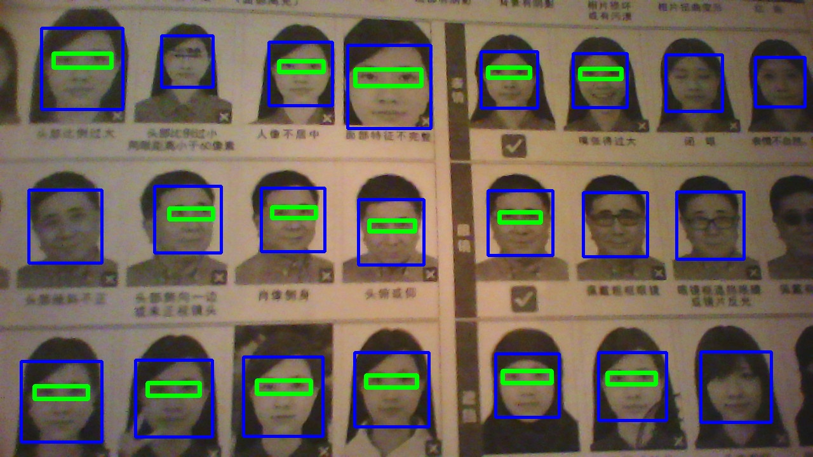

# passportpix

Take a passport photo of precisely the proper dimensions using
computer vision to pan and zoom on the face.

The program works, but does require you to edit a line by hand at the
top if you want to change the image width-to-height ratio.

Shows live camera view. Automatically centers and zooms image to be
precisely correct for passport photos. Hit spacebar to snap the photo
to "passport.jpg" and 'q' to quit. (TIP: If you leave `eog
passport.jpg` running in the background, you'll see the snapped
picture update immediately so you can tell if you like it or not).

# Customization

At the moment, size is hardcoded to 33mm x 48mm, with the distance
from the chin to the bottom of the photo being 7mm. However, it's
pretty darn easy to change by editing some numbers at the top of the
file. For example, for a US Passport, you could set `image_ratio =
2.0/2.0`.

# Assumptions

I'm assuming you will always want your eyes precisely centered in the
picture.

I assume you always want the highest resolution possible from your camera.

You'll need to have 'python-opencv' installed. (`apt install python-opencv`) 

# BUGS AND FUTURE FEATURES.

OpenCV cannot write the proper DPI to the JPEG file, so it will not
print out at the correct size without massaging. This is annoying, but
is easy enough to work around that I'm not fixing it before the
release.

You can only take one photo. Every photo you take overwrite the
previous 'passport.jpg' file.

Only the first camera is opened.

The face detection routine is a bit CPU hungry so maybe I should
downscale the image before processing it to get a better frame rate. 

I wrote this using Python2 and OpenCV2 since that's the only OpenCV
Debian GNU/Linux has packaged for Python.

# Bonus: Harpy.py

Here is a simple Python script for face detection in live video using
OpenCV. <a href="harpy.py">harpy.py</a>. Short and easy to modify if
you want to start another project like this.

